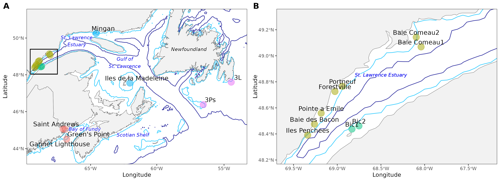
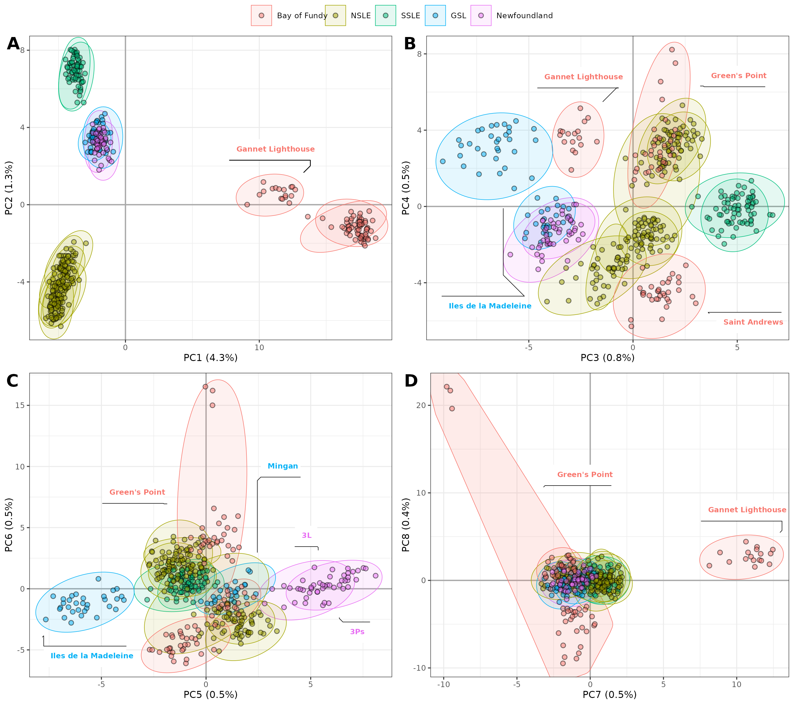
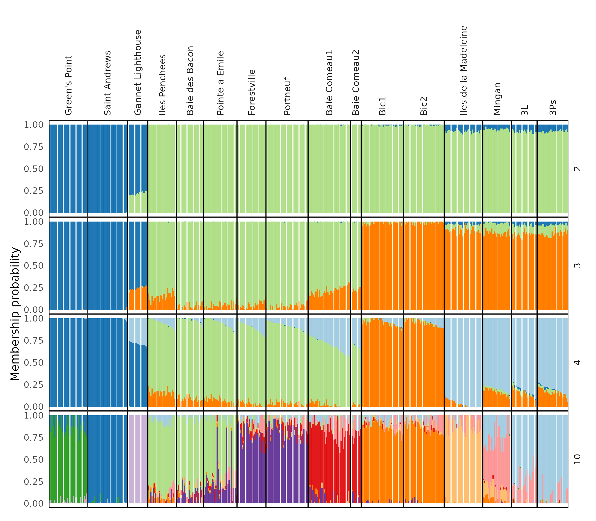
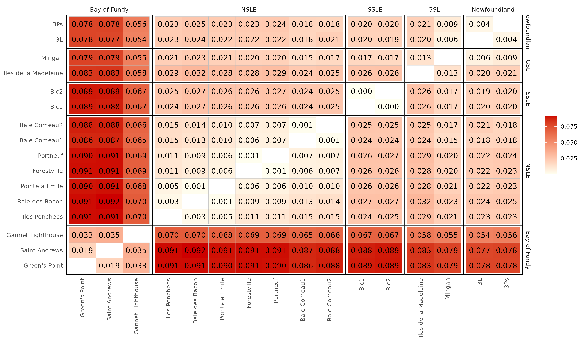
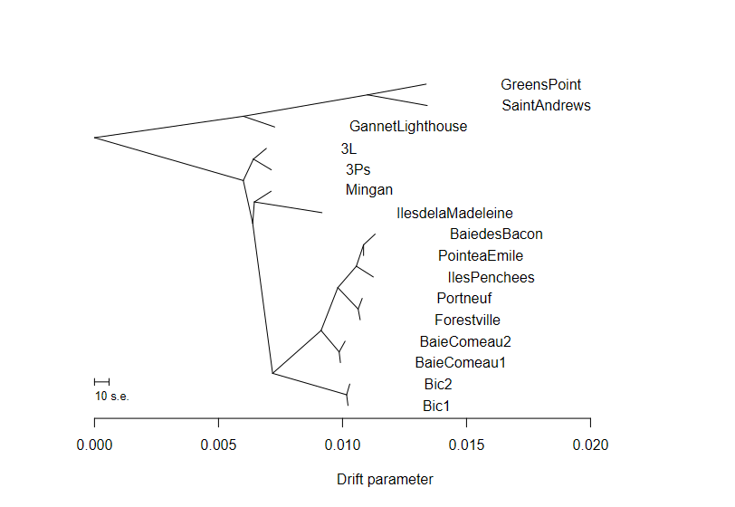
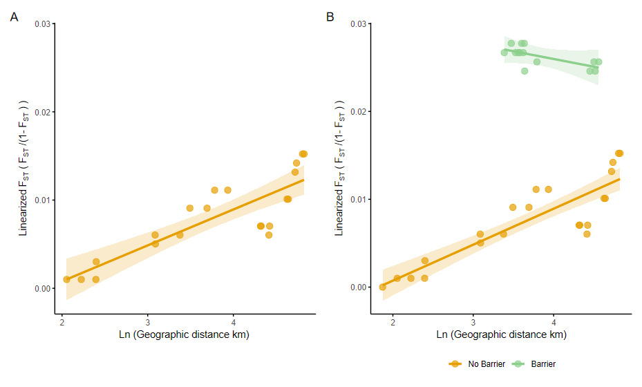

# R scripts, figures and results of the *Buccinum undatum* population genomic MS  

## Limited dispersal drives strong genetic structure in the commercially harvested gastropod *Buccinum undatum* in the Western North Atlantic  

CC D’Aloia, A Bourret, KD Baker, B Desrosiers, JA Kubelka, C Nozeres, WH Sturch, GJ Parent, BL Gianasi (Submitted).

- [Summary](#summary)
- [Status](#status)
- [Contents](#contents)
- [Main Results](#main-results)

## Summary

Direct-developing species lack the pelagic larval phase which facilitates connectivity in most marine species. Consequently, they tend to exhibit spatially restricted dispersal and increased population structure. When subject to harvesting, this biological constraint increases their vulnerability to localized depletion, as local aggregations may be unable to recover through dispersal from neighboring areas. In eastern Canada, the direct-developing whelk Buccinum undatum is targeted by commercial fisheries. Declining landings and catch per unit effort have raised concerns that the species’ fully benthic life history renders it vulnerable to localized overexploitation. Here, we leverage a large genome-wide dataset to elucidate patterns of spatial genetic structure in B. undatum and gain insight into how seascape features influence genetic connectivity. We sampled hundreds of individuals throughout Canadian northwest Atlantic waters and genotyped them at 23,405 SNPs. We detected five major genetic clusters, and considerable genetic substructure within most of these groupings. In the St. Lawrence Estuary, where geographic sampling was most intensive, isolation by distance, driven by limited dispersal along continuous habitat, was observed. Deep water also serves as a major barrier to gene flow, leading to genetic divergence among populations separated by less than 50 km. Overall, our results confirm the limited vagility and gene flow of B. undatum, which leads to hierarchical genetic structure across the seascape. These findings highlight the importance of managing whelk populations at local scales to protect distinct conservation units and support sustainable harvesting.

## Status
Ongoing-improvements

## Contents
### Folder structure

```
.
├── 00_Data                 # Main datasets are here (large files are stored locally)
├── 01_Code                 # R Scripts for the different analysis
├── 02_Results              # Figures and main output results
└── README.md
```

### Main scripts 

#### 02_Discovered_SNPs.R

Main script to obtain a All species and a B. undatum catalog of SNPs through STACKS. 

#### 03_Filter_SNPs.R

Script for high-quality filtering of the B. undatum ddRAD dataset

#### 04_PopStruct.R

Script to explore genomic structure of the B. undatum ddRAD dataset

#### 05_SNPsPower.R

Script to test SNPs power for B. undatum

#### 06_IBD_IBB_Bundatum.R

Script to test Isolation by distance (IBD) and isolation by barrier (IBB) for B. undatum

#### 07_Buccinum_treemix_plots.R

Script to create figures from treemix output

## Main Results
### SNP panels

**Library preparation, sequncing and demultiplexing**

- 6 librairies of 93-94 samples = 562, sequenced on 1 lane of NovaSeq 150 PE. This included 541 Buccinum undatum, 5 B. cyaneum, 6 B. scalariforme, 4 B. terranovae and 6 duplicated samples.
- Remove Illumina adaptor with Trimmomatic using 2:30:10:8:FALSE to keep all reads in both R1 and R2 
- Demultiplex with process_radtag module, 2 restriction enzymes (*pstI* & *mspI*), truncation at 90 pb, filter-illumina, clean, rescue and check quality options

*Running on stacks v2.64, trimmonatic v0.39, fastqc and mutliqc*

**Overall SNP panel**
- Test *de novo* parameters (m 3, M 1:8, n = M) using 2-3 samples of each species (Ntotal =  11 samples). Choose parameters: m = 3, M = 4 and n = 4. This Figure 
- Ustack with m=3, M = 4, and all 562 individuals. (552 with coverage between 5X and 35X).
- Assemble a first catalog including other species (using 88 individuals) --> test for misidentified individuals 
- 4 individuals from Mingan are not B. undatum --> S_23_01903, 1910, 1913 and 1922 (confirm at COI)

*We tried with a reference genome (Babylonia areolata) but only ~25% of mapped reads. In the end ~ 1000 SNPs using a reference genome, and ~ 200 individuals only.*

 **B. undatum SNP panel**
- Test *de novo* parameters (m 3-5, M 1:8, n = M-1, M+1) using 18 samples believe of being B. undatum. m = 3, M = 1 and n = 1.
- Ustack with m=3, M = 1, and all 562 individuals.
- Assemble a *Buccinum undatum* "only" catalog using 150 representative individuals (coverage 10x - 25x). Final catalog contains 1,025,952 loci
- Run on all B. undatum with coverage >5x (n = 535), sstacks, tsv2bam, gstacks. Genotypes 944,612 loci. **Effective per-sample coverage: mean=16.2x**, stdev=7.5x, min=3.5x, max=42.9x  4 individuals from 3P doesn't look like buccinum (to check at COI).

Filtration:
1. population module, R = 75, MAF = 0.01, on all *Buccinum undatum* individuals with > 90K loci genotyped (~ > 8X coverage, N = 451) --> 101,645 loci, 161,785 SNPs
2. On missingness, Samples (14 samples with > 30% missing snps + 6 duplicated samples) --> 431 undatum
                   SNPS (61392 snps with > 10% missing) --> 100,393 snps from 48636 loci
3. On heterozygosity, remove those with ho > 0.6  --> 98,582 SNPs from 47,673 loci
4. On too low, too high depth (<10x (n = 39), >50x (n = 538), ~ 1 - 99% quantile) --> 97,819 SNPs from 47,214 loci
5. Check library effect (6 library) with RDA (p = 0.012), identified 1724 outlier SNPs (malahobis distance, 2 axes) --> 96,095 SNPs from 46,828 loci 
6. Check for sex-linked loci (150 M and 150 F) with RDA (p = 0.002), identified 377 outlier SNPS (4*SD) -->  95,718 SNPs from 46726 loci
7. Check for individuals with too high relatedness (r > 0.3). None, but 3 parents-siblings from 1 site + 2 half cousin from another (no changes)
8. FINAL datasets: unique SNP / loci, **MAF05: 23,405 snps** (MAF01: 46,300 snps). Keep the MAF05, with **431 B. undatum**

### Figures

|  |
|---| 
| **Figure 1** Map |


PCA performed with adegenet.

|  |
|---| 
| **Figure 2** PCA |


Admixture, tested for K = 1 to 20. 

|  |
|---|
| **Figure 3** Admixture for the most relevant number of group (K = 2,3,4, 10) |


FST with dartR, 999 bootstraps, all P-values < 0.022, mean Fst = 0.0381, range 0.0003 - 0.0920

|  |
|---| 
| **Figure 4** Fst |


|  |
|---| 
| **Figure 5** Treemix |

|  |
|---| 
| **Figure 6** IBD |

